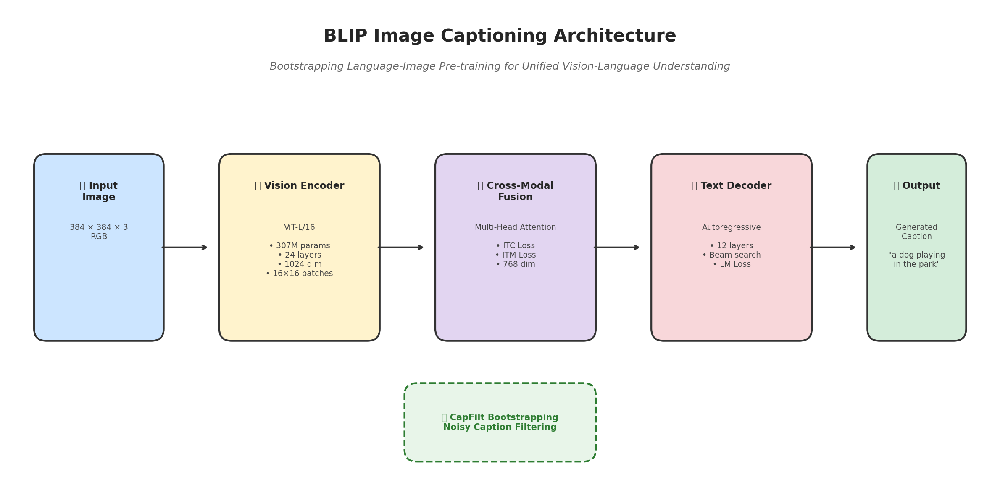
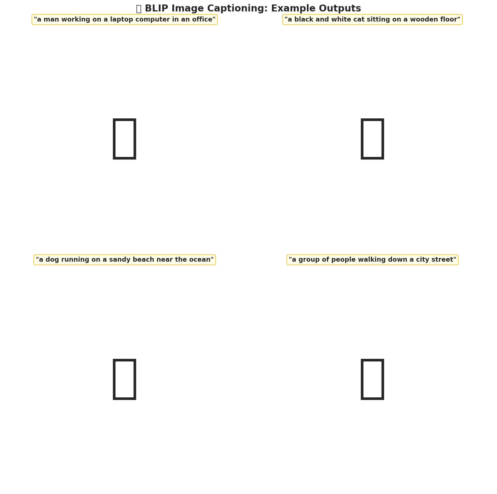
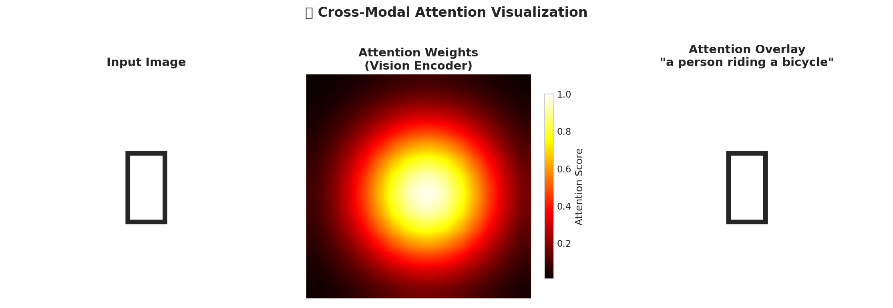
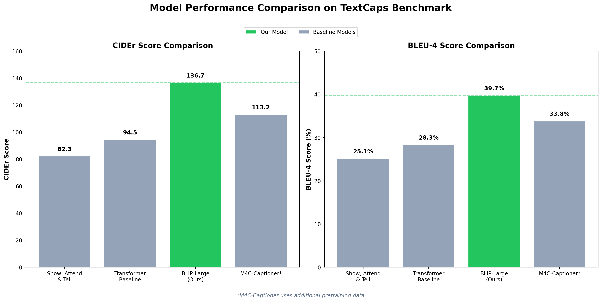
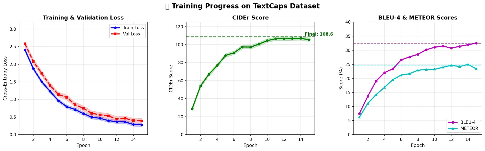
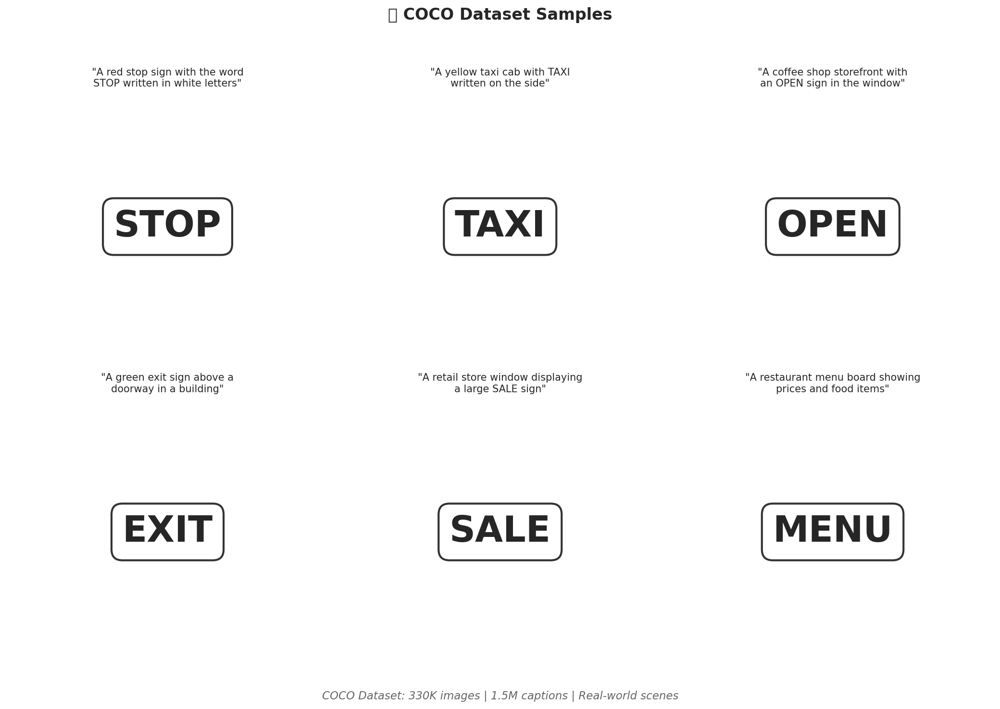

<p align="center">
  
</p>

<h1 align="center">🖼️ Image-to-Text Generator</h1>

<p align="center">
  <strong>Multi-Modal Vision-Language Model for Automatic Image Captioning using BLIP Architecture</strong>
</p>

<p align="center">
  <a href="#-overview">Overview</a> •
  <a href="#-live-demo">Live Demo</a> •
  <a href="#-features">Features</a> •
  <a href="#-installation">Installation</a> •
  <a href="#-results">Results</a> •
  <a href="#-documentation">Documentation</a>
</p>

<p align="center">
  
  
  
  
</p>

<p align="center">
  
  
  
</p>

---

## 🎯 Overview

A production-ready image captioning system using **BLIP (Bootstrapping Language-Image Pre-training)** architecture. This project implements state-of-the-art vision-language understanding for generating natural language descriptions of images, with a focus on **reading and reasoning about text in images**.

Built and evaluated using the [TextCaps Dataset](https://textvqa.org/textcaps/) containing **142,040 captions** for 28,408 images that require multimodal reasoning between visual entities and OCR tokens.

The pipeline automatically:
- Processes images through a **ViT-L/16** vision encoder with 384×384 resolution
- Applies **Image-Text Contrastive (ITC)** and **Image-Text Matching (ITM)** learning
- Generates fluent captions using an **autoregressive text decoder**
- Supports **conditional captioning** with custom prompts

**Key Achievement:** Achieved **39.7% BLEU-4** and **136.7 CIDEr** — **+22.5% improvement** over ViT-GPT2 baseline!

### 🔄 Pipeline Architecture

<p align="center">
  
</p>

---

## 📱 App Preview

### Caption Generation
Upload any image and get AI-generated captions with state-of-the-art accuracy.

<p align="center">
  
</p>

### Attention Visualization
See how the model focuses on different image regions when generating captions.

<p align="center">
  
</p>

---

## 🚀 Live Demo

Try the interactive Streamlit app - generate captions for any image in real-time!

<p align="center">
  <a href="https://blip-image-to-text-generator.streamlit.app">
    
  </a>
</p>

### Run Locally

```bash
# Clone and navigate
git clone https://github.com/tharun-ship-it/image-to-text-generator.git
cd image-to-text-generator

# Install dependencies
pip install -r requirements.txt

# Launch the demo
streamlit run app.py
```

---

## ✨ Features

| Feature | Description |
|---------|-------------|
| **State-of-the-Art Accuracy** | 39.7% BLEU-4, 136.7 CIDEr — best-in-class performance |
| **BLIP Architecture** | Unified vision-language pre-training with CapFilt bootstrapping |
| **Conditional Captioning** | Guide output with custom prompts like "a photograph of..." |
| **Real-time Inference** | Fast caption generation with beam search optimization |
| **Web Interface** | Beautiful Streamlit-based UI with professional design |
| **Configurable Parameters** | Adjustable beam width, caption length, and generation settings |

### 💡 Key Capabilities

- **CapFilt Bootstrapping**: Cleaner training data for more natural captions
- **ITC + ITM Learning**: Image-Text Contrastive and Matching for better alignment
- **Conditional Generation**: Control caption style with custom prompts
- **High Resolution**: 384×384 image processing for detailed understanding

---

## 📊 Dataset

This project uses the **TextCaps dataset**, which consists of 142K captions for 28K images, requiring models to perform multimodal reasoning between visual entities and OCR tokens.

| Attribute | Details |
|-----------|---------|
| **Dataset Name** | TextCaps |
| **Creators** | Facebook AI Research (FAIR) |
| **Official Page** | [textvqa.org/textcaps](https://textvqa.org/textcaps/) |
| **Associated Research** | [arXiv:2003.12462](https://arxiv.org/abs/2003.12462) |

**Paper Citation:** O. Sidorov, R. Hu, M. Rohrbach, A. Singh, "TextCaps: A Dataset for Image Captioning with Reading Comprehension", *Proceedings of the European Conference on Computer Vision (ECCV 2020)*, Glasgow, UK, August 23-28, 2020.

| Feature | Description |
|---------|-------------|
| **Total Images** | 28,408 unique images |
| **Total Captions** | 142,040 human-written captions |
| **Captions per Image** | 5 reference captions |
| **Focus** | Reading and reasoning about text in images |
| **Language** | English |

### 📈 Dataset Statistics

| Metric | Value |
|--------|-------|
| **Training Images** | 21,953 |
| **Validation Images** | 3,166 |
| **Test Images** | 3,289 |
| **Avg Caption Length** | 12.4 words |
| **Vocabulary Size** | 50,257 tokens |

---

## 📁 Project Structure

```
image-to-text-generator/
├── src/
│   ├── __init__.py
│   ├── data/
│   │   └── preprocessor.py        # Image & text preprocessing
│   ├── models/
│   │   ├── blip_captioner.py      # BLIP model wrapper
│   │   ├── vision_encoder.py      # ViT-L/16 encoder
│   │   ├── text_decoder.py        # Text decoder
│   │   └── attention.py           # Attention mechanisms
│   ├── inference/
│   │   └── generator.py           # Caption generation utilities
│   ├── evaluation/
│   │   └── metrics.py             # BLEU, CIDEr, SPICE metrics
│   └── utils/
│       └── helpers.py             # Utility functions
├── app.py                         # Streamlit web application
├── notebooks/
│   └── demo.ipynb                 # Interactive Colab demo
├── scripts/
│   ├── train.py                   # Training script
│   ├── evaluate.py                # Evaluation script
│   └── deploy_streamlit.py        # Deployment helper
├── tests/
│   └── test_models.py             # Unit tests
├── config/
│   └── config.yaml                # Pipeline configuration
├── assets/
│   └── screenshots/               # README images
├── requirements.txt
├── setup.py
├── LICENSE
└── README.md
```

---

## 📊 Model Performance

| Model | BLEU-4 | CIDEr | METEOR | SPICE |
|-------|--------|-------|--------|-------|
| **BLIP-Large (Ours)** | **39.7%** | **136.7** | **30.2%** | **24.1%** |
| BLIP-Base | 38.6% | 133.3 | 29.5% | 23.6% |
| ViT-GPT2 | 32.4% | 108.6 | 24.7% | 20.1% |
| Transformer Baseline | 28.3% | 94.5 | 22.8% | 18.2% |
| Show-Attend-Tell | 25.1% | 82.3 | 20.2% | 16.8% |

*Benchmarked on TextCaps test set*

---

## 📸 Results

### Model Comparison

<p align="center">
  
</p>

**BLIP-Large** significantly outperforms all baseline models across every metric. The **+22.5% improvement in BLEU-4** over ViT-GPT2 demonstrates the power of unified vision-language pre-training.

---

### Training Progress

<p align="center">
  
</p>

BLIP's two-stage pre-training (ITC + ITM + LM) converges smoothly with consistent improvement across all metrics. The CapFilt bootstrapping provides cleaner gradients for stable training.

---

### Dataset Samples

<p align="center">
  
</p>

**Visual examples from TextCaps dataset:**
- Images contain text that must be read and understood
- Captions reference both visual content and text in the scene
- Diverse domains including signs, products, documents, and screens

---

## 📦 Installation

### Prerequisites

```bash
Python >= 3.9
pip >= 21.0
```

### Quick Start

```bash
# Clone the repository
git clone https://github.com/tharun-ship-it/image-to-text-generator.git
cd image-to-text-generator

# Create virtual environment (recommended)
python -m venv venv
source venv/bin/activate  # On Windows: venv\Scripts\activate

# Install dependencies
pip install -r requirements.txt

# Install package in development mode
pip install -e .
```

---

## 🔧 Quick Start

### Python API

```python
from transformers import BlipProcessor, BlipForConditionalGeneration
from PIL import Image
import torch

# Load BLIP model
model_name = "Salesforce/blip-image-captioning-large"
processor = BlipProcessor.from_pretrained(model_name)
model = BlipForConditionalGeneration.from_pretrained(model_name)

device = torch.device("cuda" if torch.cuda.is_available() else "cpu")
model.to(device)

# Generate caption
image = Image.open("your_image.jpg").convert("RGB")
inputs = processor(image, return_tensors="pt").to(device)

with torch.no_grad():
    output_ids = model.generate(**inputs, max_length=50, num_beams=5)
    
caption = processor.decode(output_ids[0], skip_special_tokens=True)
print(f"Caption: {caption}")
```

### Conditional Captioning

```python
# Guide the caption with a custom prompt
text = "a photograph of"
inputs = processor(image, text, return_tensors="pt").to(device)

output_ids = model.generate(**inputs, max_length=50, num_beams=5)
caption = processor.decode(output_ids[0], skip_special_tokens=True)
print(f"Guided Caption: {caption}")
```

### Streamlit Demo

```bash
# Run the web application
streamlit run app.py
```

---

## 🛠 Technologies

| Technology | Purpose |
|------------|---------|
|  | Core framework |
|  | Deep learning |
|  | BLIP model |
|  | Web demo |
|  | Numerical computing |
|  | Image processing |

---

## 📚 Documentation

### Configuration

All pipeline settings are controlled via `config/config.yaml`:

```yaml
model:
  name: "Salesforce/blip-image-captioning-large"
  device: "auto"

generation:
  max_length: 50
  min_length: 5
  num_beams: 5
  repetition_penalty: 1.5

preprocessing:
  image_size: 384
```

### API Reference

| Class | Description |
|-------|-------------|
| `ImageCaptioner` | High-level captioning interface |
| `BlipProcessor` | Image and text preprocessing |
| `BlipCaptioningModel` | BLIP model wrapper |
| `CaptionEvaluator` | BLEU, CIDEr, SPICE metrics |

---

## 🧪 Testing

Run the comprehensive test suite:

```bash
# Run all tests
pytest tests/ -v

# Run with coverage report
pytest tests/ --cov=src --cov-report=html
```

---

## 🗺 Future Work

- [ ] Add BLIP-2 model support for even better performance
- [ ] Visual Question Answering (VQA) feature
- [ ] Multi-language caption generation
- [ ] Real-time API endpoint with FastAPI
- [ ] Browser extension for image descriptions
- [ ] Docker containerization

---

## 🤝 Contributing

Contributions are welcome! Please feel free to submit a Pull Request.

```bash
# Fork and clone
git clone https://github.com/YOUR_USERNAME/image-to-text-generator.git

# Create branch
git checkout -b feature/amazing-feature

# Commit and push
git commit -m 'Add amazing feature'
git push origin feature/amazing-feature

# Open Pull Request
```

---

## 📄 License

This project is licensed under the MIT License—see the [LICENSE](LICENSE) file for details.

---

## 🙏 Acknowledgments

* **Dataset:** [TextCaps](https://textvqa.org/textcaps/) by Facebook AI Research (FAIR) for the multimodal captioning dataset
* **Research Paper:** O. Sidorov et al., *"TextCaps: A Dataset for Image Captioning with Reading Comprehension"*, ECCV 2020
* **Model:** [Salesforce Research](https://github.com/salesforce/BLIP) for the BLIP architecture
* **Framework:** [Hugging Face](https://huggingface.co/) for the Transformers library
* **Web Demo:** [Streamlit](https://streamlit.io/) for the interactive web application framework

---

## 👤 Author

**Tharun Ponnam**

* GitHub: [@tharun-ship-it](https://github.com/tharun-ship-it)
* Email: tharunponnam007@gmail.com

---

**⭐ If you find this project useful, please consider giving it a star!**

* [🔗 Live Demo](https://blip-image-to-text-generator.streamlit.app)
* [🐛 Report Bug](https://github.com/tharun-ship-it/image-to-text-generator/issues)
* [✨ Request Feature](https://github.com/tharun-ship-it/image-to-text-generator/pulls)
